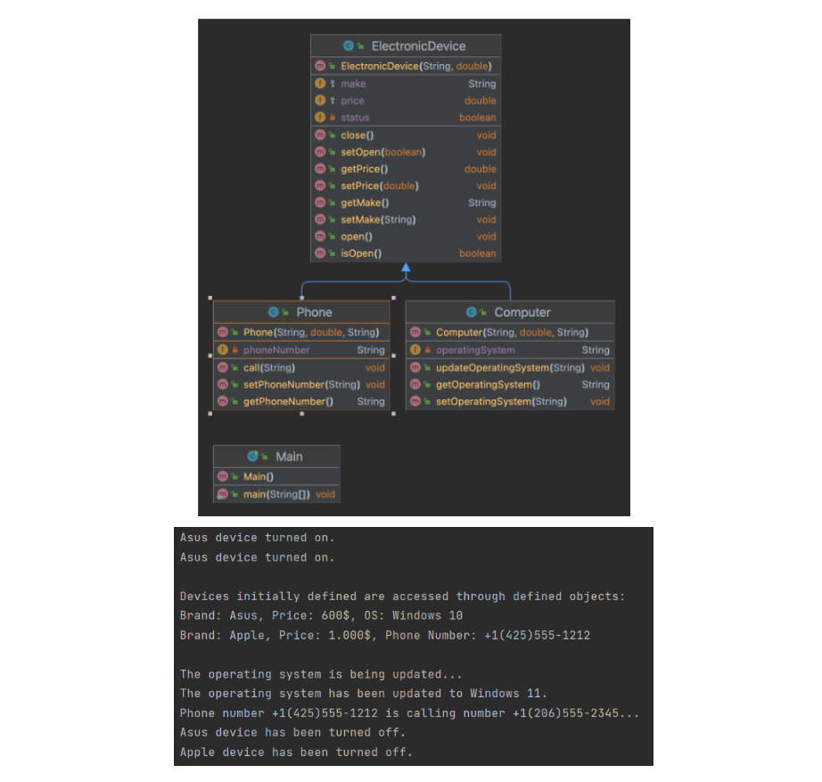
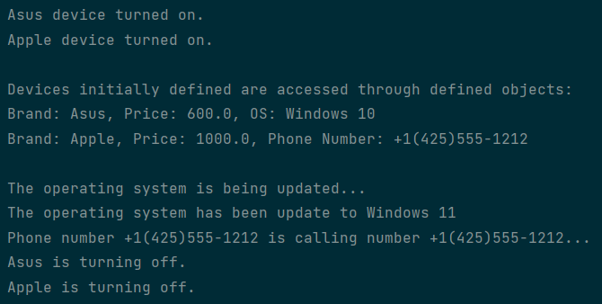

# 🏫 University Assignment OOP Course

---

In this assignment, you are asked to develop a Java application that will perform operations related to electronic devices. You will create a main "ElectronicDevice" class for electronic devices and two subclasses called "Computer" and "Phone" derived from this class. Additionally, using protected and private access controllers, you are asked to define the variables and methods of these classes as shown in the UML diagram.

- Define the "status" variable as private and other variables as protected within the "ElectronicDevice" class.

- The "Computer" and "Phone" subclasses have their own methods in addition to the "open" and "close" methods they inherit from the "ElectronicDevice" class, as shown in the UML diagram.

- These methods are "updateOperatingSystem" for the "Computer" class and "call" for the "Phone" class.

- The "updateOperatingSystem" method will query whether the device is open using the "isOpen" method, display the appropriate screen output as shown in the figure below, and assign the entered operating system to the variable in the class. If the device is not open, it will display the message "The device must be on to update the operating system."

- The "call" method will query whether the device is open using the "isOpen" method, display the appropriate screen output as shown in the figure below, and assign the entered operating system to the variable in the class. If the device is not open, it will display the message "The phone must be on to make a call."

- When opening the device, if the device is already open, it should display the message "The device is already on." When closing the device, if the device is already closed, it should display the message "The device is already off."

- In the main class, a computer and a phone will be defined to obtain the screen output shown below.

---

✅ My screen output.

    

